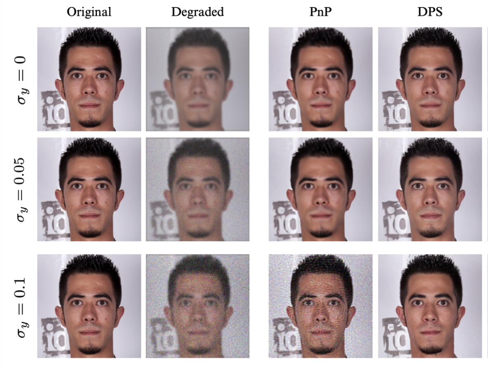

# Image Generative Models

This repository was created for the MVA course project "Generative Models for Images". The objective was to implement from scratch and compare two algorithms - Plug-and-Play (PnP) and Diffusion Posterior Sampling (DPS)- under various degradation settings, including blurring, inpainting, and subsampling. Our experiments were conducted on the FFHQ-256 dataset.

## References
- Diffusion Posterior Sampling for General Noisy Inverse Problems, Chung and al., 2024, https://arxiv.org/abs/2209.14687
- Plug-and-Play Priors for Model Based Reconstruction, Venkatakrishnan and al., 2013, https://ieeexplore.ieee.org/document/6737048
